### 실습10) Jenkins Pipeline 프로젝트 - Pipeline Syntax 사용

리눅스는 .sh 윈도우는 .bat 파일을 실행시킬 수 있다.

 stage('Git clone') {
            steps {
                git 'https://github.com/joneconsulting/jenkins_pipeline_script';
            }
        }

- git 저장소에서 소스코드를 가져오는데 사용한다.

### 실습11) Jenkins Pipeline 프로젝트 - Maven build pipeline

Maven의 정보는 Jenkins에 설치되어있는 정보이다.

-DskipTests=true
- 테스트를 진행하지 않겠다.

pipeline {
    agent any
    tools { 
      maven 'Maven3.8.5'
    }
    stages {
        stage('github clone') {
            steps {
                git branch: 'main', url: 'https://github.com/joneconsulting/cicd-web-project.git'; 
            }
            - 
            - 쉽게 명령어를 만들 수 있더.
        }
        
        stage('build') {
            steps {
                sh '''
                    echo build start
                    mvn clean compile package -DskipTests=true
                '''
            }

            - sh 블록은 쉡 스크립트를 실행하기 위해서 사용되는 블록이다.
        }
    }
}

### 실습12) Jenkins Pipeline 프로젝트 - Tomcat 서버에 배포

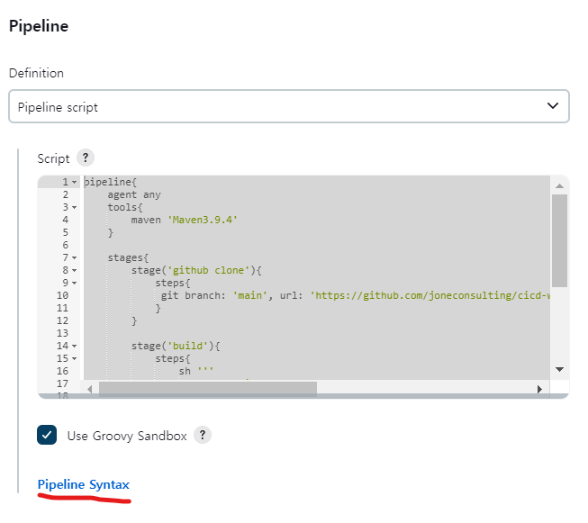
- Pipeline Syntax를 적극 사용하자.
- deploy to container

### 실습13) Jenkins Pipeline 프로젝트 - Docker 컨테이너에 배포

ssh puliisher를 이용한다.

리눅스는 grep, Windows는 findstr을 사용한다.

docker network inspect bridge
- docker container들의 ip를 확인할 수 있다.

docker rmi 복수가 가능하다.

### SonarQube 사용하기 
- 정적 분석 도구다.
- https://www.sonarqube.org
- 특징
    - 지속적인 통합과 분석을 할 때 사용된다. 코드가 가지고 있는 이슈라든가 디펙트라든가 아니면 복잡성을 분석해준다.
    - 버그나 취약성을 찾아준다.
    - 코드 안에 불필요한 코드, 코드의 이상 여부를 탐지할 수 있다.
젠킨스의 순서는 빌드 -> 테스트 코드 -> 정적, 동적 분석 -> package -> deploy

소나큐브 설치시 환경마다 이미지가 다르므로 잘 확인하자.

docker pull sonarqube

docker run --rm -p 9000:9000 --name sonar
qube sonarqube
- --rm 컨테이너가 실행을 왈료한 후 삭제를 한다.

- 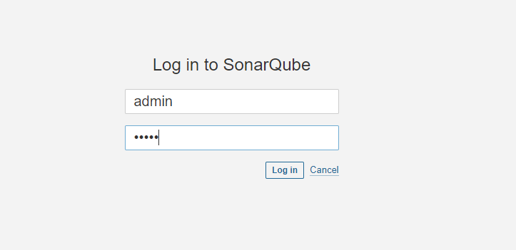

### 실습14) SonarQube + Maven 프로젝트 사용하기

Maven 프로젝트를 실제 소나큐브에서 분석하기 위해서는 plugin이 필요하다
- https://docs.sonarsource.com/sonarqube/9.8/analyzing-source-code/scanners/sonarscanner-for-maven/
    - 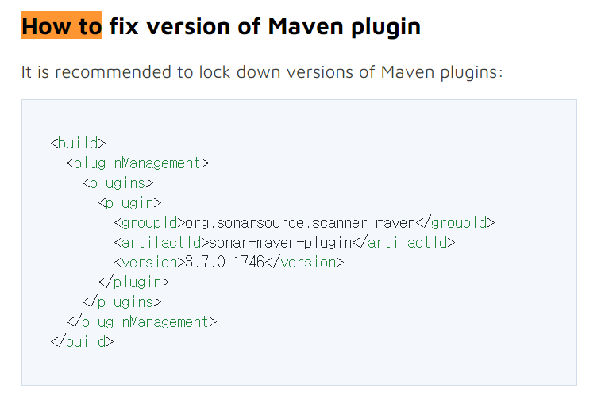
- https://mvnrepository.com/artifact/org.sonarsource.scanner.maven/sonar-maven-plugin

- 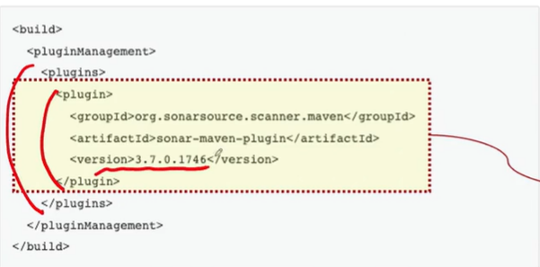
    - 이런식으로 pom.xml도 설정해줘야한다.

- sonarqube 초기 아이디 : admin, 비밀번호 : admin

우리가 가지고 있는 프로젝트에서 소나큐브에 결과를 요청하기 위해서는 소나큐브에서 발급한 토큰이 하나가 필요합니다.

토큰 발급
- My Account -> Security -> User Token 생성
- 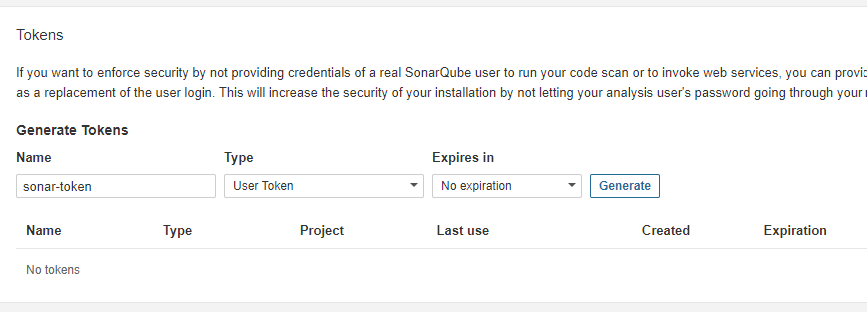
- squ_16557c64aa2f7e04586ca58a312c5095b9060c43
- gradle은 : squ_6b39996d56c42d6a750c29c6221aa19b7b6b87ff
    - secret text이다.
- mvn sonar:sonar -Dsonar.host.url=http://localhost:9000 -Dsonar.login=squ_16557c64aa2f7e04586ca58a312c5095b9060c43

-Maven에서 SonarQube 빌드
mvn sonar:sonar -Dsonar.host.url=http://IP_address:9000 -Dsonar.login=[the-sonar-token]
Windows Powershell 등에서 명령어 오류가 발생하면 다음과 같이 인용부호(작은따옴표)를 붙이고 실행
mvn sonar:sonar '-Dsonar.host.url=http://IP_address:9000''-Dsonar.login=[the-sonar-token]'

- 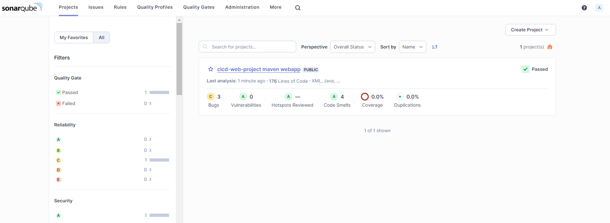

### 실습15) Bad code 조사하기

mvn clean compile package -DskipTests=true

### Jenkins + SonarQube 연동
1. Jenkins 플러그인 SonarQube Scanner for Jenkins를 설치하면된다.
- Manage Jenkins -> Manage Credentials -> Add Credentials
2. 소나큐브에 접속하기 위해 액세스 토큰을 하나 등록해야한다.
- 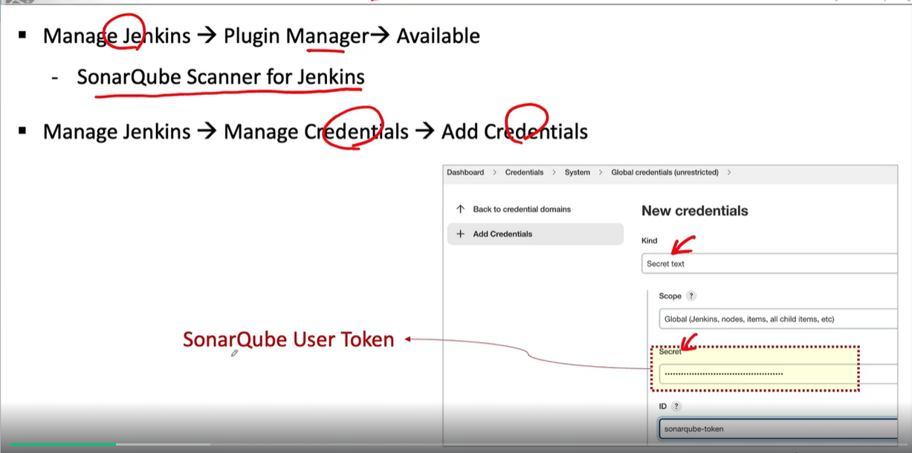
- 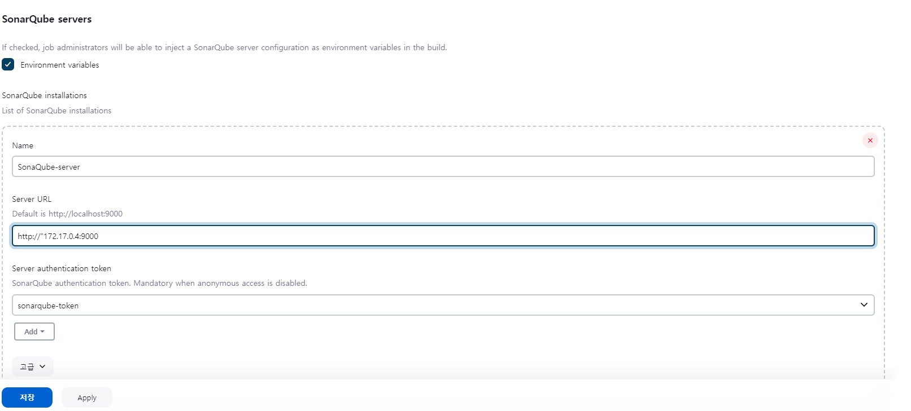

### 실습16) SonarQube 사용을 위한 Pipeline 사용하기

- 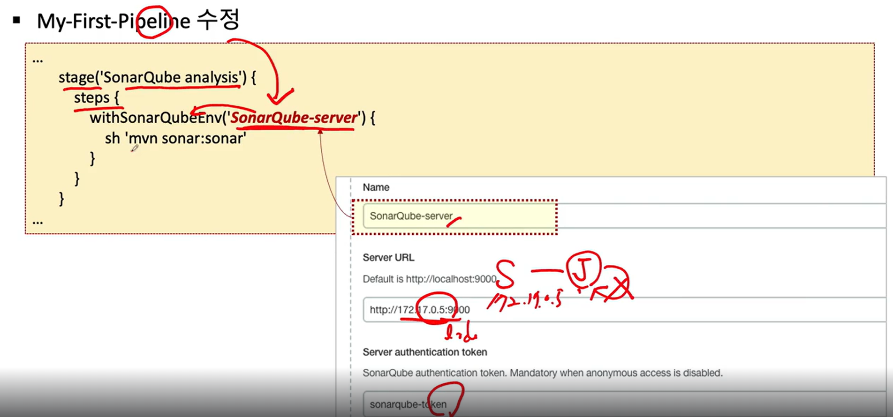  

stage('SonarQube analysis'){
            steps{
                withSonarQubeEnv('SonarQube-server'){
                    sh 'mvn sonar:sonar'
                }
            }
        }

- deploy ssh 주석처리 왜냐 sonarqube는 빌드 후 코드들을 정적분석해서 pass를 해야 deploy할것이기 때문이다.
1. sonarqube 서버 설치
2. sonarqube credential 설정
3. sonarqube server 설정
4. pipeline 설정

### Jenkins Multi nodes 구성하기 - Master + Slaves

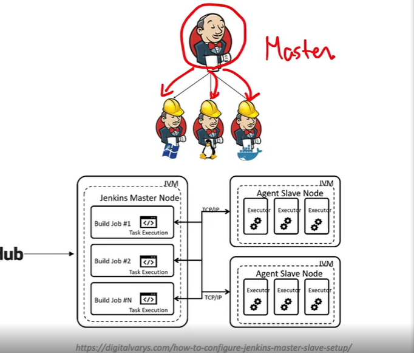
Jenkins Slave
- Remote에서 실행되는 Jenkins 실행 Node
- Jenkins Master의 요청 처리
- Master로부터 전달된 Job실행
- 다양한 운영체제에서 실행 가능
- Jenkins 프로젝트 생성시 특정 Slave를 선택하여 실행 가능

### 실습17) Jenkins Node 추가하기
새로운 Jenkins 서버1 실행 
Windows, MacOS intel chip) docker run --privileged --name jenkins-node1 -itd -p 30022:22 -e container=docker -v /sys/fs/cgroup:/sys/fs/cgroup --cgroupns=host edowon0623/docker:latest /usr/sbin/init

Jenkins 서버에 JDK 설치
yum install -y ncurses git // clear와 git을 사용하려고
yum list java*jdk-devel
yum install -y java-11-openjdk-devel.aarch64

Manage Jenkins -> Manage Nodes -> New Node
- Number of executors: 5  
    - Jenkins 마스터로부터 작업 즉 빌드하거나 어떤 배포하는 작업에 대한 요청을 받았을 때 그걸 처리시켜 줄 수 있는 최대 개수를 의미한다.

Jenkins 마스터가 빌드가 끝난 다음에 Workspace라는 공간이 생겼었다. workspace에 프로젝트 단위로 실제 폴더가 생기고 결과파일들이 저장되었다.

Remote root directory
- slave의 결과의 파일이 저장되고자 하는 폴더

label
- 현재 사용하고 있는 Jenkins의 프로젝트에서 다른 쪽에 있는 프로젝트라던가 다른 쪽에 있는 파이프라인이 지금 추가하고 있는 노드를 지정하고자 할 때 사용되는 이름입니다.

Usage
- Jenkins마스터가 slave를 선택할 때 어떤 기준으로 선택할 것할것인지

Launch method
- 어떤 방식으로 접속할지 정하는것이다.

컨테이너 안에 있는 컨테이너끼리는 22번 포트를 그냥 사용하면 된다.
포워딩은 window같은 밖에서 접속할 때 지정해주는것이다.

- 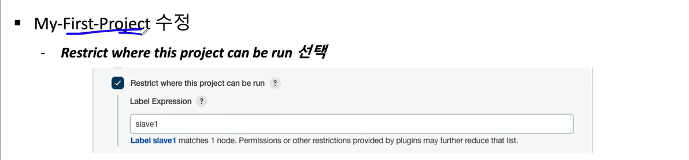
    - 누가 빌드할지 지정해 주는것이다.

master에서 node로 접속하기 위해서 키를 하나 등록해 보겠따.

키값이 없어도 접속할 수 있도록 키를 복사한다.
ssh-keygen
ssh-copy-id root@172.17.0.5
#### Jenkins Node 추가하기 다시하기

### 1005 회사
루트 권한 docker 접속
- docker exec -itu 0 {container_id} /bin/bash

JDK 17 설치 방법 1 : jenkins_1 컨테이너에 접속해서 설치
docker exec -it jenkins_1 bash
apt-get update
apt-get install openjdk-17-jdk -y

mlocate 설치 및 검색
apt-get install mlocate
updatedb
locate java | fgrep 17 | fgrep javac
find : /usr/lib/jvm/java-17-openjdk-amd64ㄷ

http://localhost:8088/demo/add?name=jinho&number=1232

